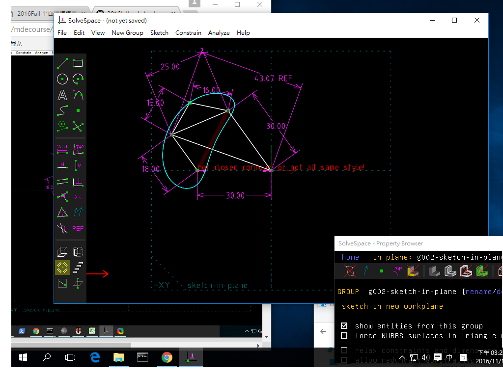
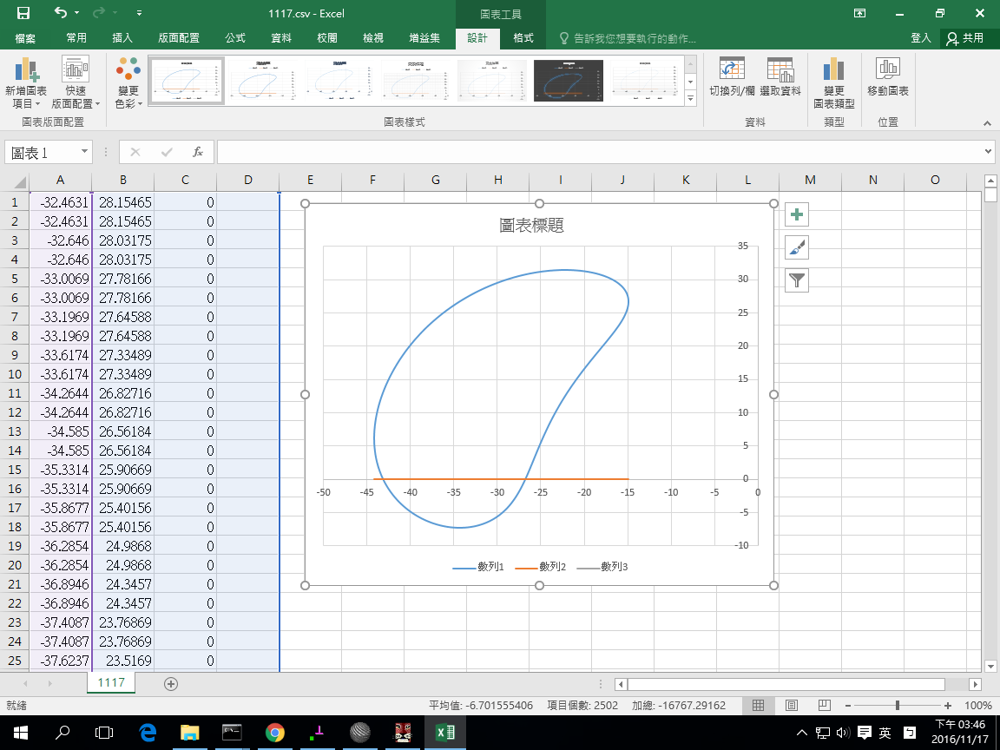

Title:1-12 電腦輔助設計實習課程總結
Date: 2017-1-12 2:00
Category: hw
Tags: 
Author: 40423106

<!-- PELICAN_END_SUMMARY -->

2016-11-17

有關 Solvespace 機構模擬功能介紹, 與 Python3 及 Brython 程式驗證

<h2>Solvespace 平面四連桿機構模擬</h2>

直接利用 Solvespace Analyze-Trace Point-Stop Trace 得到下列繞行路徑:

根據下圖, 試驗證 Solvespace 機構模擬的資料之正確性.

將所得到的點座標 .csv 以 Excel 畫圖, 得到:

2016-11-24
## Solvespace

### 1. Parts (零件繪製)

範例檔案: <a href="http://solvespace.com/bracket.pl">http://solvespace.com/bracket.pl</a>
#### Extrude (平行長出或除料)

<iframe src="./../w7/121.html" width="800" height="600"></iframe>

#### Lathe (旋轉繞行長出或除料)

#### Export Triangle Mesh

STL 格式

three.js

<iframe src="./../w7/1124-6.html" width="800" height="600"></iframe>

### 2. Assembly (零件組立)

### 3. Linkages (fourbar & multilink) (四連桿與多連桿運動模擬)

### 4. Compiled & API (編譯與延伸應用)

使用 Virtualbox 虛擬主機執行 Windows 64 位元與 Ubuntu 64 位元環境中的編譯與延伸應用.

Virtualbox Ubuntu 64位元虛擬檔案: http://140.130.17.17/public/Ubuntu/1604_solvespace_final/Ubuntu_160464.vdi (只有在區網可以下載)

在虛擬主機中完成 Solvespace 編譯與執行的參考畫面:
<iframe src="./../w7/1124-3.png" width="800" height="600"></iframe>

2016-12-1
## Solvespace

### 1. Solvespace 組合圖

<iframe src="./../w7/128.html" width="800" height="600"></iframe>

 2016-12-22
 ## 3D列印
<iframe src="./../w7/3d/20161222.html" width="800" height="600"></iframe>
## 支柱
<iframe src="./../w7/3d/20161217-1.html" width="800" height="600"></iframe>
## 連接桿
<iframe src="./../w7/3d/20161217.html" width="800" height="600"></iframe>
## 底盤
<iframe src="./../w7/3d/20161217-5.html" width="800" height="600"></iframe>
## 圓盤
<iframe src="./../w7/3d/20161217-3.html" width="800" height="600"></iframe>

 
<iframe src="https://player.vimeo.com/video/190854427" width="640" height="360" frameborder="0" webkitallowfullscreen mozallowfullscreen allowfullscreen></iframe> 
<a href="https://vimeo.com/190854427">2016 11 09 20 05 42 998</a> from <a href="https://vimeo.com/user45854799">40423106</a> on <a href="https://vimeo.com">Vimeo</a>.

<iframe src="https://player.vimeo.com/video/190854371" width="640" height="360" frameborder="0" webkitallowfullscreen mozallowfullscreen allowfullscreen></iframe> 
<a href="https://vimeo.com/190854371">2016 11 09 20 04 08 141</a> from <a href="https://vimeo.com/user45854799">40423106</a> on <a href="https://vimeo.com">Vimeo</a>.

<iframe src="https://player.vimeo.com/video/185637674" width="640" height="360" frameborder="0" webkitallowfullscreen mozallowfullscreen allowfullscreen></iframe> 
<a href="https://vimeo.com/185637674">錄製_2016_10_05_20_31_24_791</a> from <a href="https://vimeo.com/user45854799">40423106</a> on <a href="https://vimeo.com">Vimeo</a>.

